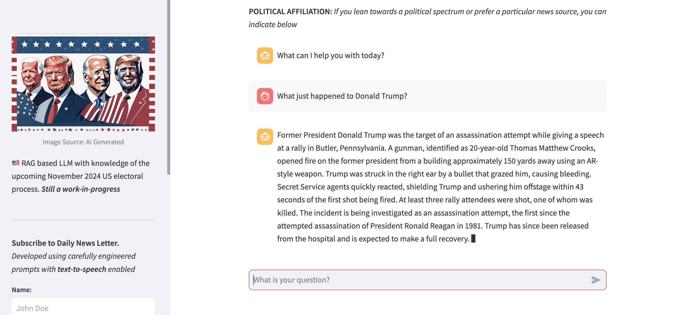
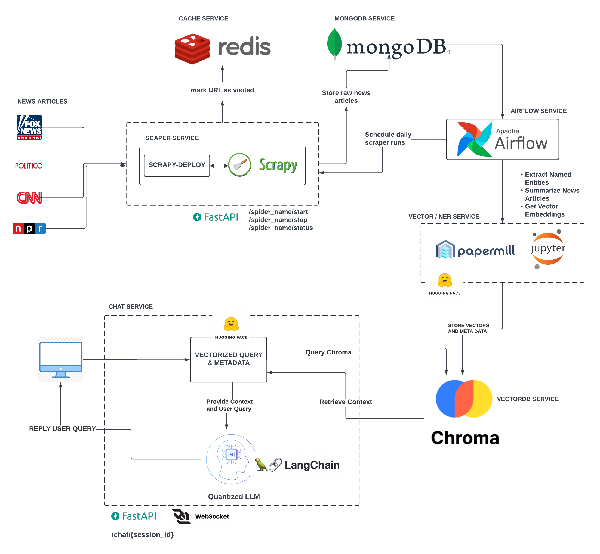
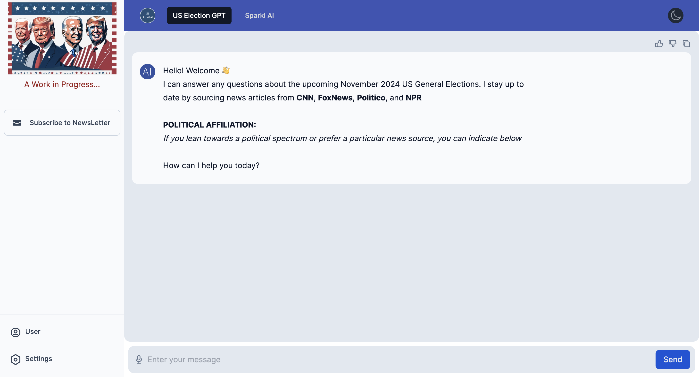

# US-Elections-GPT: 
### Analyzing and Predicting US Election Trends with RAG-enabled GPT

 

This project leverages the power of Generative Pre-trained Transformers (GPT) 
in understanding, analyzing, and predicting trends in US elections. It does this by sourcing news articles from 
websites such as **Fox News**, **CNN**, **NPR**, and **Politico** ensuring that whether you are liberal or conservative, 
your political views can be represented in the answers generated by the LLM.

## Architecture Design
A simplified architecture diagram of the product is shown below:

## SERVICES

#### <ins>SCRAPER SERVICE & MONGODB</ins>
First, news articles are scraped from news sources and loaded into MongoDB. To ensure that all sides of the political 
spectrum are represented in the LLM, both right-wing and left-wing news sources, as well as those in the middle ground, 
are scraped. Users can select which side of the political spectrum they prefer when querying the LLM..

#### <ins>AIRFLOW, NEWS SUMMARY, & NAMED ENTITY EXTRACTION</ins>
Airflow is used with Papermill and Jupyter Notebook to summarize news articles using HuggingFace summarization pipeline,
extract named entities using spaCy, and obtain vector embeddings using HuggingFace SentenceTransformer. The news articles,
their summaries, and extracted entities including **_PERSON_**, **_ORG_**, and **_LOCATION_** are loaded into ChromaDB datastore.

#### <ins>REDIS CACHE</ins>
The news article URLs are cached in Redis to ensure that each webpage is visited and scraped only once 

#### <ins>CHAT SERVICE & LANGCHAIN</ins>
The chat service is created using LangChain and HuggingFace pipeline. First, a  Mistral 7B model (which may be 
substituted with a different model in the future) is fine-tuned into a 4-bit float model using **_bitsandbytes_**. This is 
done to reduce model footprint and speed up inference. 
LangChain is used to create a RAG-based model using the quantized model and ChromaDB, where the news article vector 
embeddings are stored. Redis is used to store chat sessions so that sessions can be revisited with ease.

#### <ins>FASTAPI & WEBSOCKET</ins>
A WebSocket server is created using FastAPI to serve the langchain model. 

## MODEL OPTIMIZATIONS
To ensure that accurate retrieval is done during model chat querying, some LLM optimizations were performed. These optimizations
include small-to-big retrievals, re-ranking, and metadata search using extracted named entity recognition

## TO RUN

- Rename `.env.example` to `.env` and fill in the variables. 
- Run `docker compose build` to build the images and 
- Run `docker compose up` to start the services. 
