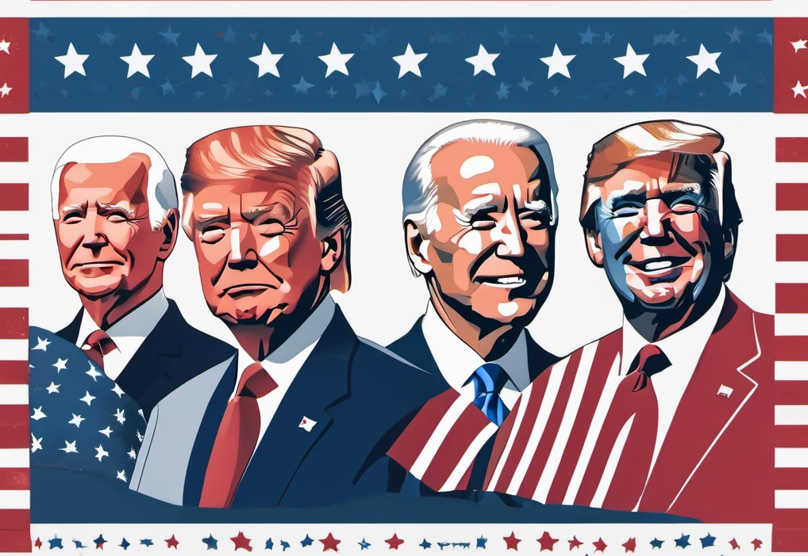

# US-Elections-GPT: 
### Analyzing and Predicting US Election Trends with GPT

 
This project leverages the power of Generative Pre-trained Transformers (GPT) 
in understanding, analyzing, and predicting trends in US elections. It does this by harnessing the capabilities of 
state-of-the-art natural language processing (NLP) models to delve into the vast troves of textual data surrounding US 
elections, providing insights, forecasts, and tools for researchers, journalists, and enthusiasts alike.

With the ever-increasing volume of information generated during election cycles, extracting meaningful insights can be 
a daunting task. US-Elections-GPT offers a comprehensive toolkit for processing, analyzing, and visualizing 
election-related data, enabling users to uncover patterns, sentiments, and emerging trends with ease.

Whether you're interested in sentiment analysis of political speeches, predicting election outcomes based on social 
media chatter, or understanding the impact of news articles on voter sentiment, US-Elections-GPT provides the tools and
resources necessary to explore these complex dynamics.