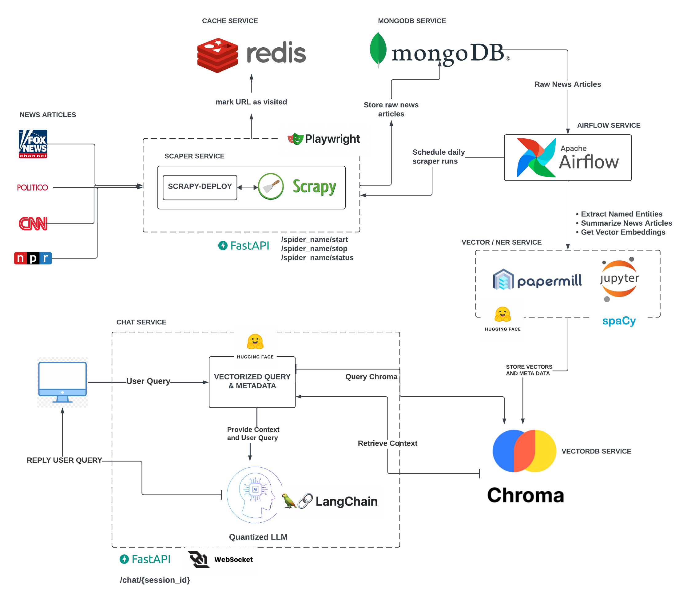

# US-Elections-GPT: 
### Analyzing and Predicting US Election Trends with RAG-enabled GPT

 

This project leverages the power of Generative Pre-trained Transformers (GPT) 
in understanding, analyzing, and predicting trends in US elections. It does this by sourcing news articles from 
websites such as **FoxNews**, **CNN**, **NPR**, and **Politico** making sure that whether you are liberal or conservative, 
your political views can be represented in the answers generated by the LLM.

## Architecture Design
A simplified architecture diagram of the product is shown below:

First, news articles are scraped from news sources, and loaded into MongoDB. To ensure that all sides of the political 
spectrum are represented in the LLM, right-winged and left-winged news sources as well as the middle ground are scraped.
Users can select which side of the political spectrum when 